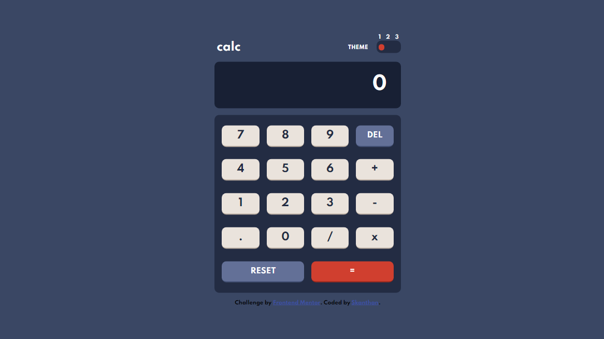

# Frontend Mentor - Calculator app solution

This is a solution to the [Calculator app challenge on Frontend Mentor](https://www.frontendmentor.io/challenges/calculator-app-9lteq5N29). Frontend Mentor challenges help you improve your coding skills by building realistic projects.

## Table of contents

- [How to use this calculator](#guide)
- [Overview](#overview)
  - [The challenge](#the-challenge)
  - [Screenshot](#screenshot)
  - [Links](#links)
- [My process](#my-process)
  - [Built with](#built-with)
  - [What I learned](#what-i-learned)
  - [Continued development](#continued-development)
  - [Useful resources](#useful-resources)
- [Author](#author)

## Guide

This is a basic calculator able to perform a single operation with 2 values at a time. To work with negative numbers, click the subtraction button, input a number, and press the equal sign to get a negative value.

## Overview

### The challenge

Users should be able to:

- See the size of the elements adjust based on their device's screen size
- Perform mathematical operations like addition, subtraction, multiplication, and division
- Adjust the color theme based on their preference
- **Bonus**: Have their initial theme preference checked using `prefers-color-scheme` and have any additional changes saved in the browser (I did not do this)

### Screenshot

### Links

- Solution URL: [Solution Link](https://www.frontendmentor.io/solutions/basic-calculator-made-using-vanilla-jscsshtml-2-kf7BR7C)
- Live Site URL: [Site Link](https://skanthanvijay.github.io/FrontendMentor-Calculator-App/)

## My process

### Built with

- Vanilla JS
- Vanilla CSS
- Vanilla HTML

### What I learned

When creating the scripts for toggling theme changes, I spent an hour trying to figure out why the second theme was not working despite the code being logically correct. I then opened the inspection tool using chrome, and realized there was a typo in the code. As for what this taught me, it was to use the inspection tool as soon as I see a problem in order to solve it more quickly.

### Continued development

This project was made entirely using vanilla Javascript. Many areas of the code, particularly in the file for the theme toggling scripts, could have been much shorter had I waited until I learned how to use jQuery and React.js. I might revisit the code for this project at a later date and compare how it could be more efficient had I used those tools, and also how the calculator could have been coded to do more complex operations while keeping the code efficient.

### Useful resources

- [The Complete Web Development Bootcamp](https://www.udemy.com/course/the-complete-web-development-bootcamp/) - This is the course I am using to learn and apply web development concepts.

## Author

- Skanthan V.
